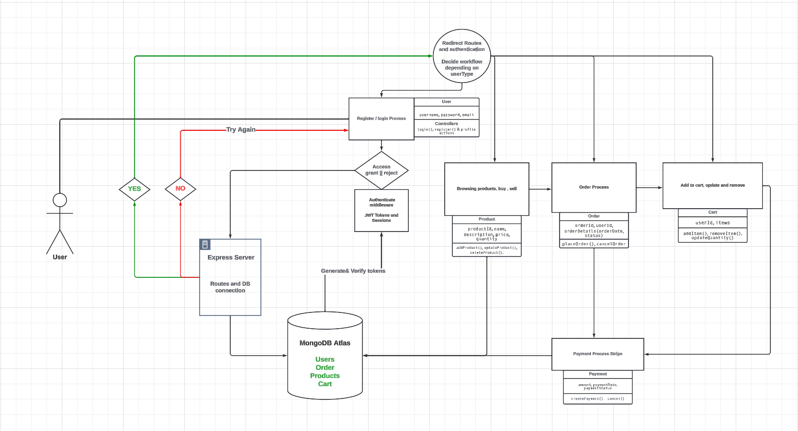

## Overview
This MERN stack application is a tiny store application, designed as a learning project during PerScholas bootcamp program to enhance my software engineering skills by addressing various full-stack development challenges. It was chosen specifically to encounter and solve common software development problems in a practical context.

## Structure
Building a project that cumulatively encompasses various aspects of software engineering, from database management to frontend development.
The development process was organized in a workflow approach that incrementally builds both the client and server sides.

## Repository Structure
The project has two separate repositories:

Client Repository: For the frontend development.
Server Repository: For the backend development.

## Installation and Setup Instructions
### Cloning the Repositories
Clone both the client and server repositories from GitHub.

client: https://github.com/besioini/market-pulse-react

server: https://github.com/besioini/market-pulse-server
### Dependency Installation
Navigate to each repo directory in two separate terminals and run:
```bash
npm install
```
This command will install all necessary dependencies for each part of the project.

## Usage
### Running the Server
- Ensure you have the latest version of Node.js installed.
- Navigate to the server directory and run:
```bash
nodemon server
```
This will start the Express server.

### Running the Client
- Navigate to the client directory and run:
```bash
npm run dev
```
This will launch the client-side application.

## Technology Stack
### Server
- Framework: Express.js
- Database: MongoDB
- Libraries: CORS, Nodemon, Bcrypt, JWT

### Client
- React
- Styling: Plain CSS

## Features
- **User Registration and Authentication**: User registration and login functionality, with password encryption and JWT for session management.
- **Product Browsing and Search**: Users can browse, search, and filter products posted by sellers.
- **Shopping Cart Management**: Adding products to the cart.
- **Seller Interface**: For product listing and order management, seller can post, update and remove products. 
- **User Account Management**: Profile updates, password changes, and order history viewing.
- **Responsive Design**: Ensuring a seamless user experience across various devices.
### Stretching Goal
- **Checkout Process**: Including shipping information entry, payment processing, and order review.
- **Order Confirmation and Tracking**: Users receive detailed confirmation and can track their orders .

### Application design flowchart

